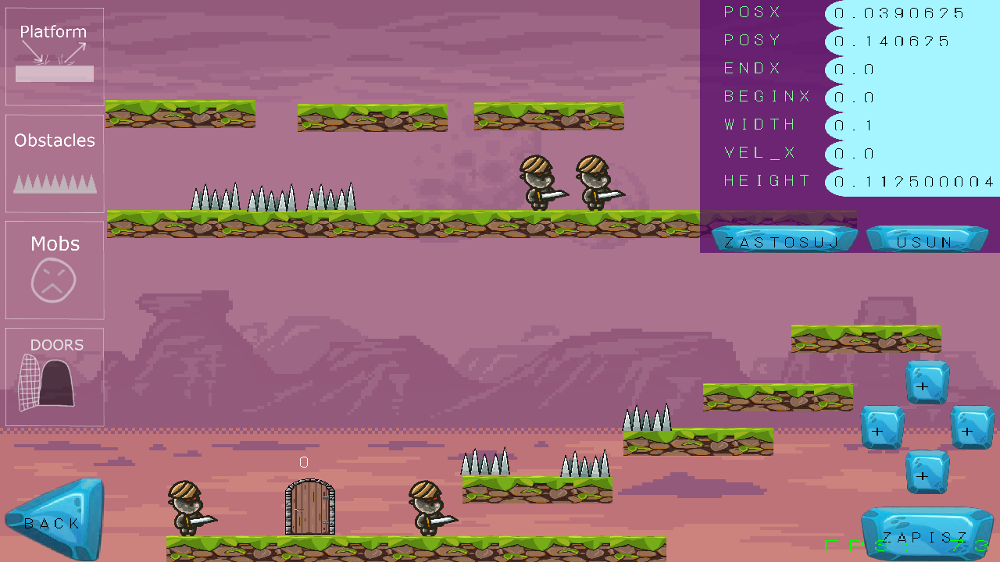
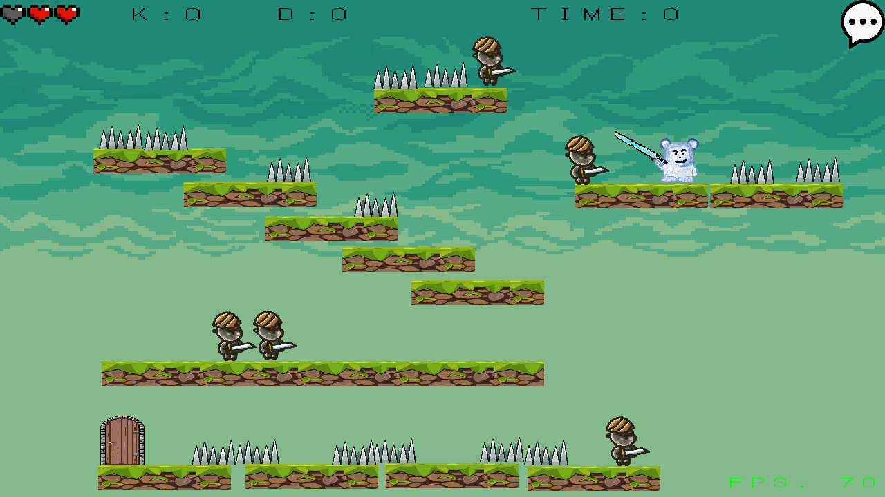
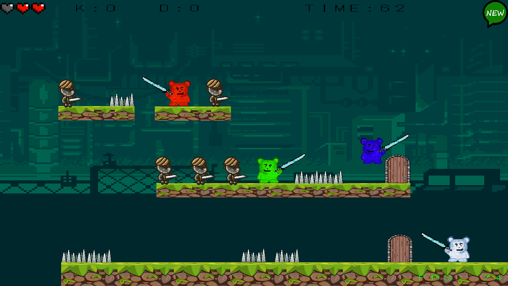

# Dom Korkowy | 2020

## Spis treści
- [Dom Korkowy | 2020](#dom-korkowy--2020)
  - [Spis treści](#spis-treści)
  - [O projekcie](#o-projekcie)
  - [Wykorzystane narzędzia](#wykorzystane-narzędzia)
  - [Edytor map](#edytor-map)
  - [Singleplayer](#singleplayer)
  - [Multiplayer](#multiplayer)

## O projekcie
Dom Korkowy to platformowa gra 2D z możliwością tworzenia i edycji map. Użytkownik może grać w trybie singleplayer lub multiplayer. Aplikacja działa w technologii klient-serwer, dzięki czemu możliwa jest równoczesna rozgrywka wielu graczy, nawet na pojedynczym urządzeniu. Mapy są przechowywane w bazie danych przy użyciu MySQL.

## Wykorzystane narzędzia
* Java 15
* MySQL 8.0.22
* Hibernate 5.4.25
* LWJGL 3.2.3

## Edytor map
Użytkownik może edytować dowolną mapę znajdującą się w zasobach lokalnych lub rozpocząć tworzenie nowej mapy. Mapa składa się z wielu scen, połączonych za pomocą drzwi. Na każdej scenie może znajdować się dowolna liczba komponentów, w tym platform, przeszkód oraz przeciwników. Każdy z dodawanych komponentów posiada własne konfigurowalne parametry.
Na każdym etapie edycji użytkownik może zapisać postępy oraz przetestować mapę w trybie single-player. Edytowaną mapę użytkownik może wysłać do zasobów na serwerze.  

## Singleplayer
W trybie single-player gracz gracz wybiera mapę z zasobów lokalnych lub pobiera nową mapę z zasobów serwera. W drugim przypadku warunkiem koniecznym jest poprawne nawiązanie połączenia z serwerem w trakcie uruchamiania programu. Po wybraniu mapy gracz rozpoczyna rozgrywkę. Celem rozgrywki single-player jest zdobycie jak najwięcej punktów w danym czasie. Czas rozgrywki jest ustalany przez twórcę mapy.  

## Multiplayer
W trybie multi-player użytkownik wybiera jeden z dostępnych na serwerze pokoi lub zakłada własny, określając jego parametry (w tym nazwę, maksymalną liczbę graczy, mapę). Po dołączeniu do wolnego pokoju użytkownik jest przekierowany do lobby, w którym czeka na pozostałych graczy. Po zadeklarowaniu gotowości przez wszystkich graczy w pokoju rozpoczyna się rozgrywka. W zależności od trybu gracze są podzieleni na dwie drużyny, zdobywając punkty poprzez zabicie gracza z drużyny przeciwnej, lub grają samodzielnie, niszcząc wszystko co się rusza. Wygrywa gracz lub drużyna, która zdobyła najwięcej punktów.
W trakcie rozgrywki użytkownicy mogą się komunikować za pomocą czatu.
Po zakończonej rozgrywce na ekranie wyświetlane są statystyki, w szczególności liczba zabójstw, śmierci oraz czas rozgrywki.  

